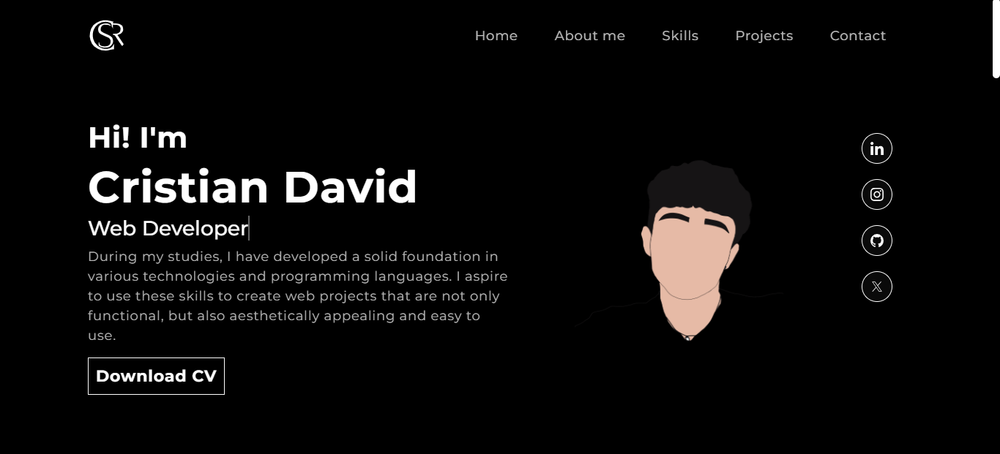

# Vista previa del Portafolio

La siguiente imagen muestra la interfaz principal de mi portafolio web desarrollado en **React 18**, utilizando tecnologías modernas como **Bootstrap 5**, **react-router-dom**, animaciones con **AOS** y **Animate.css**, y componentes visuales reutilizables. La aplicación está diseñada como una SPA (Single Page Application), con diseño responsivo y navegación fluida.

🔗 Puedes ver el sitio en línea aquí: [cristiandcm.netlify.app](https://cristiandcm.netlify.app/)
